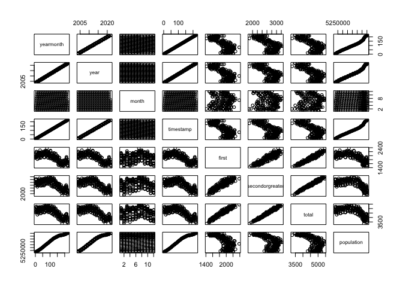
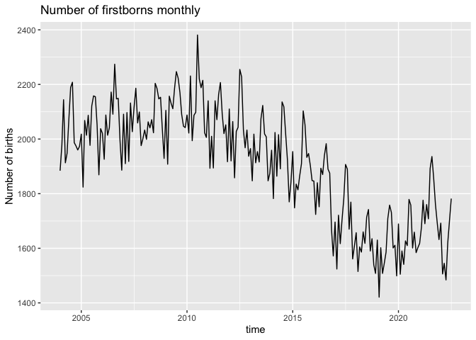
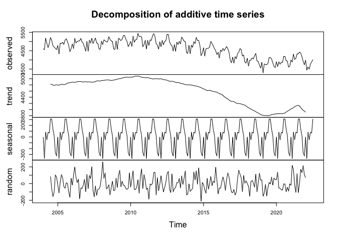
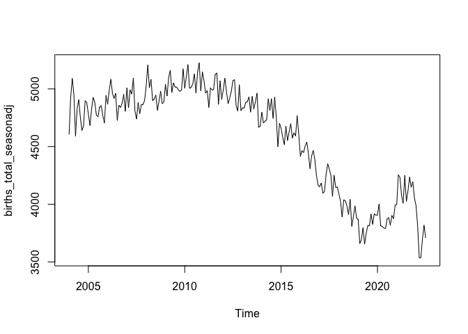
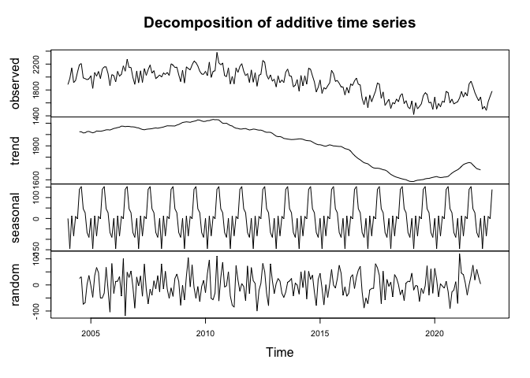
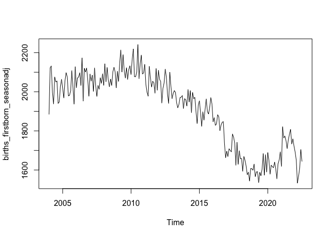
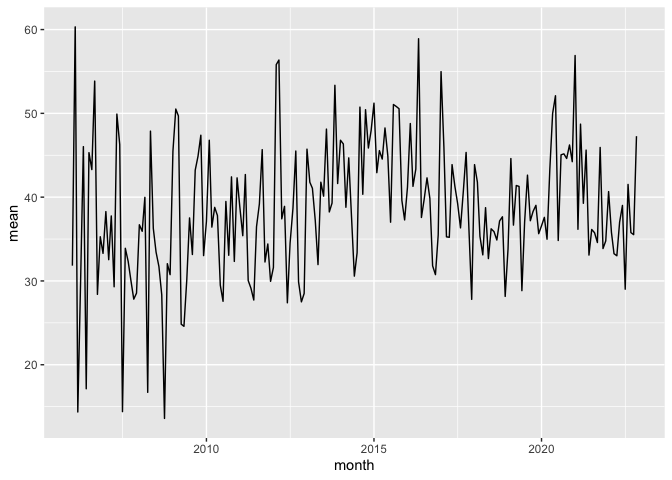
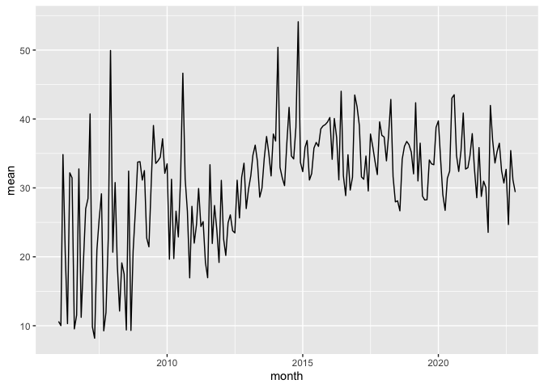
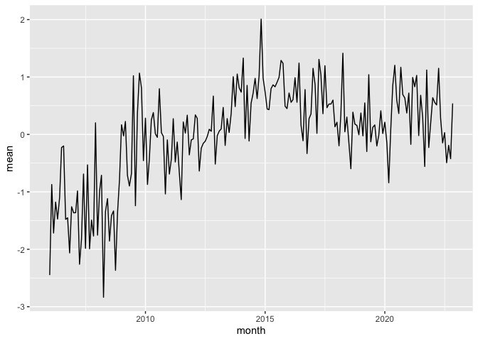

This is analysis part of Master Thesis written by Pekka Haimi.  
Aim of the analysis:

* Import Finnish birth and population data

+ Download Google Trends data with the TrendEcon package for individual keywords

+ Aggregate Google Trends data from daily to monthly level
 

Importing birth data, decomposing and seasonally adjusting it

```r
## Loading needed libraries
library(trendecon)
library(rmarkdown)
library(ggplot2)
library(prophet)
```

```
## Loading required package: Rcpp
```

```
## Loading required package: rlang
```

```r
library(lubridate)
```

```
## Loading required package: timechange
```

```
## 
## Attaching package: 'lubridate'
```

```
## The following objects are masked from 'package:base':
## 
##     date, intersect, setdiff, union
```

```r
library(dplyr)
```

```
## 
## Attaching package: 'dplyr'
```

```
## The following objects are masked from 'package:stats':
## 
##     filter, lag
```

```
## The following objects are masked from 'package:base':
## 
##     intersect, setdiff, setequal, union
```

```r
library(tidyverse)
```

```
## ── Attaching packages
## ───────────────────────────────────────
## tidyverse 1.3.2 ──
```

```
## ✔ tibble  3.1.8     ✔ purrr   0.3.5
## ✔ tidyr   1.2.1     ✔ stringr 1.4.1
## ✔ readr   2.1.3     ✔ forcats 0.5.2
## ── Conflicts ────────────────────────────────────────── tidyverse_conflicts() ──
## ✖ purrr::%@%()             masks rlang::%@%()
## ✖ purrr::as_function()     masks rlang::as_function()
## ✖ lubridate::as.difftime() masks base::as.difftime()
## ✖ lubridate::date()        masks base::date()
## ✖ dplyr::filter()          masks stats::filter()
## ✖ purrr::flatten()         masks rlang::flatten()
## ✖ purrr::flatten_chr()     masks rlang::flatten_chr()
## ✖ purrr::flatten_dbl()     masks rlang::flatten_dbl()
## ✖ purrr::flatten_int()     masks rlang::flatten_int()
## ✖ purrr::flatten_lgl()     masks rlang::flatten_lgl()
## ✖ purrr::flatten_raw()     masks rlang::flatten_raw()
## ✖ lubridate::intersect()   masks base::intersect()
## ✖ purrr::invoke()          masks rlang::invoke()
## ✖ dplyr::lag()             masks stats::lag()
## ✖ lubridate::setdiff()     masks base::setdiff()
## ✖ purrr::splice()          masks rlang::splice()
## ✖ lubridate::union()       masks base::union()
```

```r
## Importing birth and population data
birthdata <- read_csv("birthsandpopulationY04Y22.csv",  col_types = cols(timestamp = col_date(format = "%Y-%m-%d")))
ggplot(birthdata, aes(x=timestamp, y=total)) + geom_line() + labs(x="time", y="Number of births", title="Total number of births monthly") 
```

<!-- -->

```r
ggplot(birthdata, aes(x=timestamp, y=first)) + geom_line() + labs(x="time", y="Number of births", title="Number of firstborns monthly") 
```

<!-- -->

```r
#decomposing total births
births_total<-birthdata$total
births_total <- ts(births_total,start=c(2004,1),end=c(2022,7),frequency=12)
decomp_births_total <- decompose(births_total)
plot(decomp_births_total)
```

<!-- -->

```r
#seasonally adjusting total births
births_total_seasonadj <- births_total - decomp_births_total$seasonal
plot.ts(births_total_seasonadj)
```

<!-- -->

```r
#decomposing firstborns
births_firstborn<-birthdata$first
births_firstborn <- ts(births_firstborn,start=c(2004,1),end=c(2022,7),frequency=12)
decomp_births_firstborn <- decompose(births_firstborn)
plot(decomp_births_firstborn)
```

<!-- -->

```r
#seasonally adjusting firstborns
births_firstborn_seasonadj <- births_firstborn - decomp_births_firstborn$seasonal
plot.ts(births_firstborn_seasonadj)
```

<!-- -->

Downloading Google trends data for specified keywords and adjusting the seasonality with TrendEcon package


```r
#Downloading raw data

#proc_keyword_init("raskaustesti", "FI")
#proc_keyword_init("clearblue", "FI")
#proc_keyword_init("ovulaatiotesti","FI")
#proc_keyword_init("raskauspahoinvointi","FI")

### Creating composite index of the birth keywords
kw_syntyvyys <- c("raskaustesti","clearblue","ovulaatiotesti","raskauspahoinvointi")

proc_index(kw_syntyvyys,"FI","syntyvyysindex")
```

```
## .latest_google_date: 2099-01-01
```

```
## previous_google_date: 2022-11-15
```

```
## Downloading keyword: raskaustesti
```

```
## Downloading hourly data
```

```
## Downloading data for now 7-d
```

```
## Downloading daily data
```

```
## Downloading data for 2022-08-17 2022-11-15
```

```
## Downloading data for 2022-08-18 2022-11-15
```

```
## Downloading weekly data
```

```
## Downloading data for 2021-11-15 2022-11-15
```

```
## Downloading data for 2021-11-22 2022-11-15
```

```
## Downloading monthly data
```

```
## Downloading data for 2006-01-01 2022-11-15
```

```
## Downloading data for 2006-02-01 2022-11-15
```

```
## combining frequencies of keyword: raskaustesti
```

```
## extend daily data by hourly data for the missing recent days
```

```
## align daily data to weekly
```

```
## align weekly data to monthly
```

```
## seasonal adjustment keyword: raskaustesti
```

```
## .latest_google_date: 2022-11-15
```

```
## previous_google_date: 2022-11-15
```

```
## keyword clearblue already processed today. skipping.
```

```
## .latest_google_date: 2022-11-15
```

```
## previous_google_date: 2022-11-15
```

```
## keyword ovulaatiotesti already processed today. skipping.
```

```
## .latest_google_date: 2022-11-15
```

```
## previous_google_date: 2022-11-15
```

```
## keyword raskauspahoinvointi already processed today. skipping.
```

```r
###Importing seasonally adjusted data for keywords
raskaustesti_sa <- read_csv("raw/fi/raskaustesti_sa.csv", col_types = cols(time = col_date(format = "%Y-%m-%d")))
raskaustesti_sa$month <- floor_date(raskaustesti_sa$time, "month")
raskaustesti_monthly <- (raskaustesti_sa %>% group_by(month) %>% summarize(mean = mean(value)))

clearblue_sa <- read_csv("raw/fi/clearblue_sa.csv", col_types = cols(time=col_date(format = "%Y-%m-%d")))
clearblue_sa$month <- floor_date(clearblue_sa$time, "month")
clearblue_monthly <- (clearblue_sa %>% group_by(month) %>% summarize(mean = mean(value)))

ovulaatiotesti_sa <- read_csv("raw/fi/ovulaatiotesti_sa.csv", col_types = cols(time=col_date(format = "%Y-%m-%d")))
ovulaatiotesti_sa$month <- floor_date(ovulaatiotesti_sa$time, "month")
ovulaatiotesti_monthly <- (ovulaatiotesti_sa %>% group_by(month) %>% summarize(mean = mean(value)))

raskauspahoinvointi_sa <- read_csv("raw/fi/raskauspahoinvointi_sa.csv", col_types = cols(time=col_date(format = "%Y-%m-%d")))
raskauspahoinvointi_sa$month <- floor_date(raskauspahoinvointi_sa$time, "month")
raskauspahoinvointi_monthly <- (raskauspahoinvointi_sa %>% group_by(month) %>% summarize(mean = mean(value)))

##Plotting the individual seasonally adjusted keywords
ggplot(raskaustesti_monthly, aes(x=month,y=mean)) + geom_line()
```

<!-- -->

```r
ggplot(clearblue_monthly, aes(x=month,y=mean)) + geom_line()
```

<!-- -->

```r
ggplot(ovulaatiotesti_monthly, aes(x=month,y=mean)) + geom_line()
```

<!-- -->

```r
ggplot(raskauspahoinvointi_monthly, aes(x=month,y=mean)) + geom_line()
```

<!-- -->

```r
#Creating index for births and plotting it
syntyvyysindeksi <- read_csv("raw/fi/syntyvyysindex_sa.csv", col_types = cols(time = col_date(format = "%Y-%m-%d"), 
                                                                              value = col_number()))
syntyvyysindeksi$month <- floor_date(syntyvyysindeksi$time, "month")
syntyvyysindeksi %>% group_by(month) %>% summarize(mean = mean(value))
```

```
## # A tibble: 203 × 2
##    month        mean
##    <date>      <dbl>
##  1 2006-01-01 -2.45 
##  2 2006-02-01 -0.872
##  3 2006-03-01 -1.72 
##  4 2006-04-01 -1.18 
##  5 2006-05-01 -1.47 
##  6 2006-06-01 -1.10 
##  7 2006-07-01 -0.229
##  8 2006-08-01 -0.201
##  9 2006-09-01 -1.48 
## 10 2006-10-01 -1.45 
## # … with 193 more rows
```

```r
syntyvyysindeksi_monthly <- (syntyvyysindeksi %>% group_by(month) %>% summarize(mean = mean(value)))

ggplot(syntyvyysindeksi_monthly, aes(x=month,y=mean)) + geom_line()
```

<!-- -->

