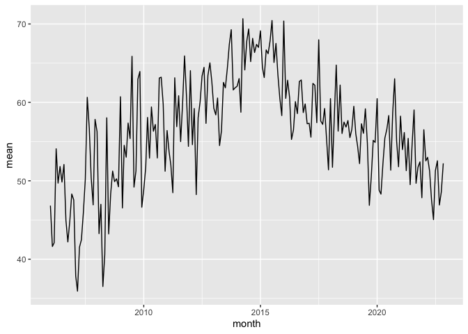

This is analysis part of Master Thesis written by Pekka Haimi.  
Aim of the analysis:

* Import Finnish birth and population data

+ Download Google Trends data with the TrendEcon package for individual keywords

+ Aggregate Google Trends data from daily to monthly level 

+ Creating index of multiple keywords

+ Plotting all data

Next steps are creating forecasting model and testing if individual keywords and the composite index make it more accurate
 


### Loading needed libraries


```r
library(trendecon)
library(rmarkdown)
library(ggplot2)
library(prophet)
library(lubridate)
library(dplyr)
library(tidyverse)
```

### Importing birth and population data


```r
birthdata <- read_csv("birthsandpopulationY04Y22.csv",  col_types = cols(timestamp = col_date(format = "%Y-%m-%d")))
ggplot(birthdata, aes(x=timestamp, y=total)) + geom_line() + labs(x="time", y="Number of births", title="Total number of births monthly") 
```

<!-- -->

```r
ggplot(birthdata, aes(x=timestamp, y=first)) + geom_line() + labs(x="time", y="Number of births", title="Number of firstborns monthly") 
```

<!-- -->

### Decomposing total births and firstborns

```r
births_total<-birthdata$total
births_total <- ts(births_total,start=c(2004,1),end=c(2022,7),frequency=12)
decomp_births_total <- decompose(births_total)
plot(decomp_births_total)
```

<!-- -->

```r
births_firstborn<-birthdata$first
births_firstborn <- ts(births_firstborn,start=c(2004,1),end=c(2022,7),frequency=12)
decomp_births_firstborn <- decompose(births_firstborn)
plot(decomp_births_firstborn)
```

<!-- -->


### Seasonally adjusting total births and comparing it to unadjusted data

```r
births_total_seasonadj <- births_total - decomp_births_total$seasonal
plot.ts(births_total_seasonadj)
```

<!-- -->

```r
ggplot(birthdata, aes(x=timestamp, y=total)) + geom_line() + labs(x="time", y="Number of births", title="Total number of births monthly") 
```

<!-- -->

### Seasonally adjusting firstborns and comparing it to unadjusted data

```r
births_firstborn_seasonadj <- births_firstborn - decomp_births_firstborn$seasonal
plot.ts(births_firstborn_seasonadj)
```

<!-- -->

```r
ggplot(birthdata, aes(x=timestamp, y=first)) + geom_line() + labs(x="time", y="Number of births", title="Number of firstborns monthly") 
```

<!-- -->


### Downloading Google trends data for specified keywords and adjusting the seasonality with TrendEcon package


```r
## Downloading raw data

proc_keyword_init("raskaustesti", "FI")
proc_keyword_init("clearblue", "FI")
proc_keyword_init("ovulaatiotesti","FI")
proc_keyword_init("raskauspahoinvointi","FI")
```

### Creating composite index of the birth keywords

```r
kw_syntyvyys <- c("raskaustesti","clearblue","ovulaatiotesti","raskauspahoinvointi")

#proc_index(kw_syntyvyys,"FI","syntyvyysindex")
```

### Importing seasonally adjusted data of keywords and turning it to monthly data

```r
raskaustesti_sa <- read_csv("raw/fi/raskaustesti_sa.csv", col_types = cols(time = col_date(format = "%Y-%m-%d")))
raskaustesti_sa$month <- floor_date(raskaustesti_sa$time, "month")
raskaustesti_monthly <- (raskaustesti_sa %>% group_by(month) %>% summarize(mean = mean(value)))

clearblue_sa <- read_csv("raw/fi/clearblue_sa.csv", col_types = cols(time=col_date(format = "%Y-%m-%d")))
clearblue_sa$month <- floor_date(clearblue_sa$time, "month")
clearblue_monthly <- (clearblue_sa %>% group_by(month) %>% summarize(mean = mean(value)))

ovulaatiotesti_sa <- read_csv("raw/fi/ovulaatiotesti_sa.csv", col_types = cols(time=col_date(format = "%Y-%m-%d")))
ovulaatiotesti_sa$month <- floor_date(ovulaatiotesti_sa$time, "month")
ovulaatiotesti_monthly <- (ovulaatiotesti_sa %>% group_by(month) %>% summarize(mean = mean(value)))

raskauspahoinvointi_sa <- read_csv("raw/fi/raskauspahoinvointi_sa.csv", col_types = cols(time=col_date(format = "%Y-%m-%d")))
raskauspahoinvointi_sa$month <- floor_date(raskauspahoinvointi_sa$time, "month")
raskauspahoinvointi_monthly <- (raskauspahoinvointi_sa %>% group_by(month) %>% summarize(mean = mean(value)))
```

### Plotting the individual seasonally adjusted keywords on monthly level

```r
ggplot(raskaustesti_monthly, aes(x=month,y=mean)) + labs(title="Seasonally adjusted keyword index for raskaustesti") + geom_line()
```

<!-- -->

```r
ggplot(clearblue_monthly, aes(x=month,y=mean)) + labs(title="Seasonally adjusted keyword index for clearblue") + geom_line()
```

<!-- -->

```r
ggplot(ovulaatiotesti_monthly, aes(x=month,y=mean)) + labs(title="Seasonally adjusted keyword index for ovulaatiotesti") + geom_line()
```

<!-- -->

```r
ggplot(raskauspahoinvointi_monthly, aes(x=month,y=mean)) + labs(title="Seasonally adjusted keyword index for raskauspahoinvointi") + geom_line()
```

<!-- -->

### Creating index for multiple keywords and plotting the index and for comparison the total births index

```r
syntyvyysindeksi <- read_csv("raw/fi/syntyvyysindex_sa.csv", col_types = cols(time = col_date(format = "%Y-%m-%d"), 
                                                                              value = col_number()))
syntyvyysindeksi$month <- floor_date(syntyvyysindeksi$time, "month")
syntyvyysindeksi %>% group_by(month) %>% summarize(mean = mean(value))
```

```
## # A tibble: 203 × 2
##    month         mean
##    <date>       <dbl>
##  1 2006-01-01 -2.10  
##  2 2006-02-01 -1.20  
##  3 2006-03-01 -1.85  
##  4 2006-04-01 -0.976 
##  5 2006-05-01 -1.14  
##  6 2006-06-01 -1.15  
##  7 2006-07-01  0.0155
##  8 2006-08-01 -0.215 
##  9 2006-09-01 -0.685 
## 10 2006-10-01 -1.19  
## # … with 193 more rows
```

```r
syntyvyysindeksi_monthly <- (syntyvyysindeksi %>% group_by(month) %>% summarize(mean = mean(value)))

ggplot(syntyvyysindeksi_monthly, aes(x=month,y=mean)) + labs(title="Seasonally adjusted index for birth related keywords") + geom_line()
```

<!-- -->

```r
plot.ts(births_total_seasonadj)
```

<!-- -->

